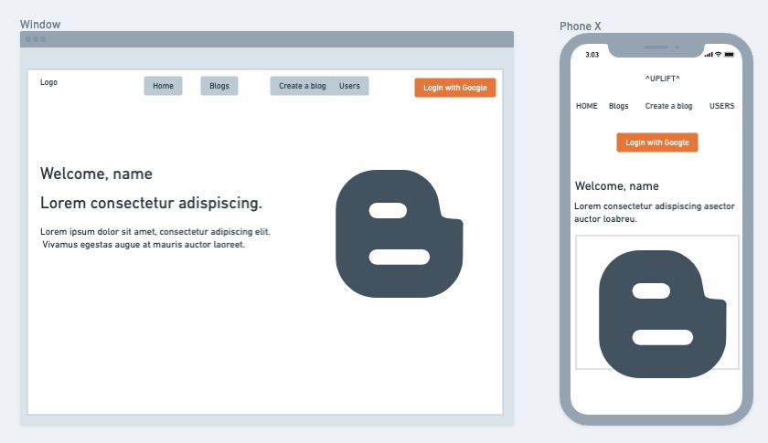
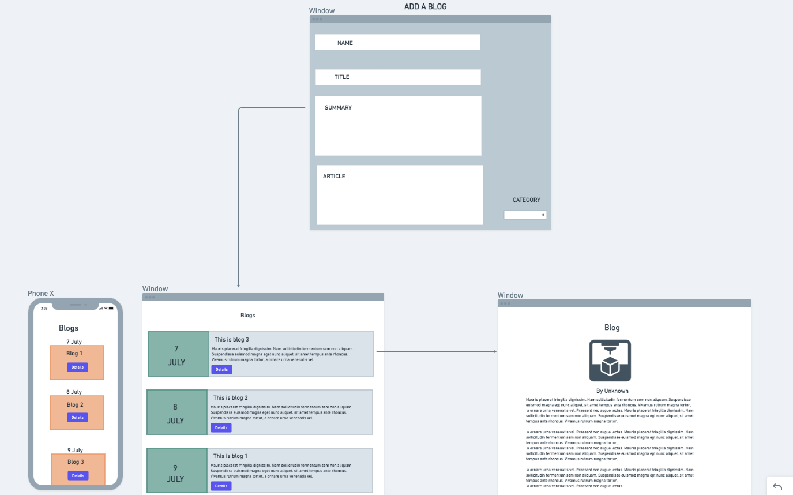
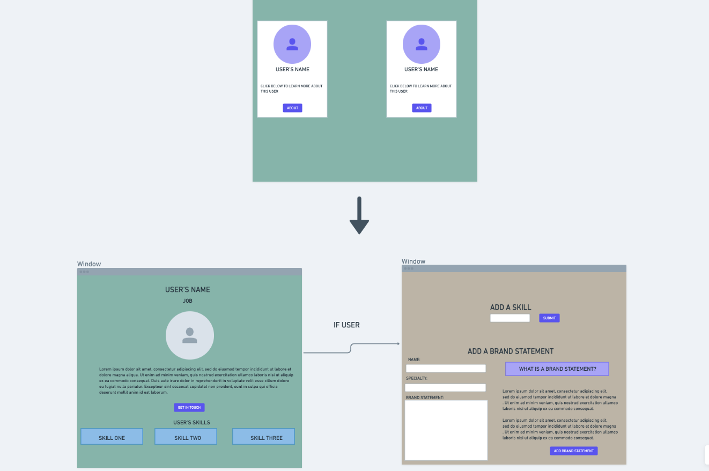
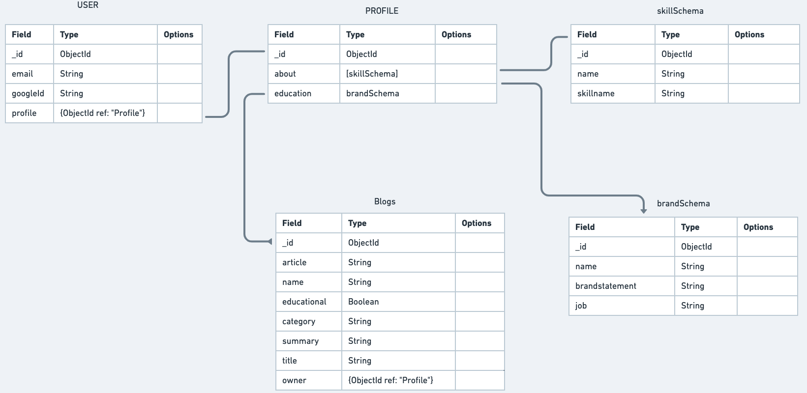
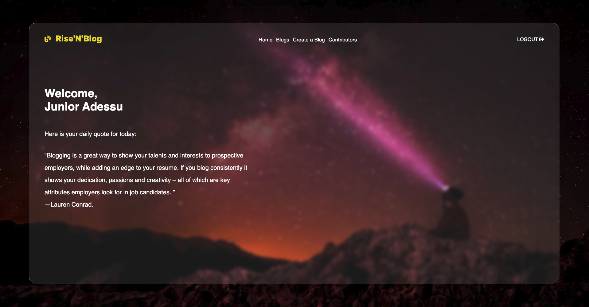
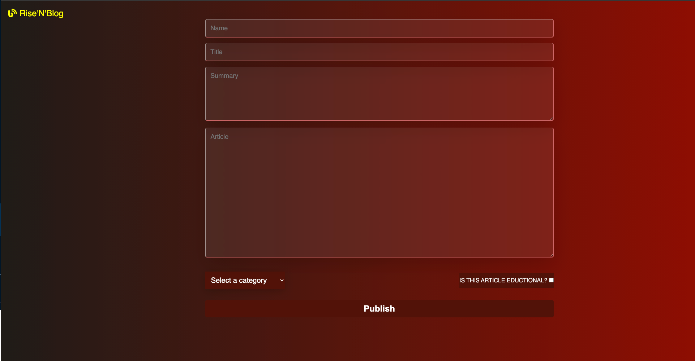
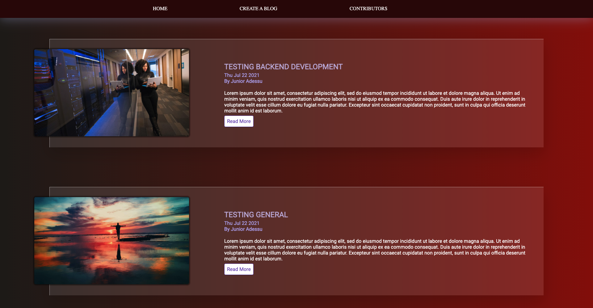
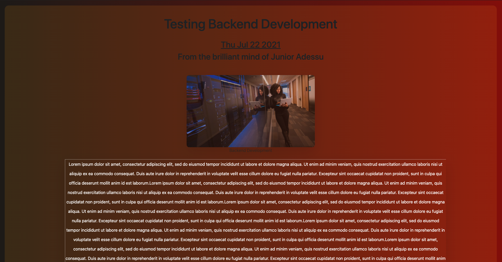
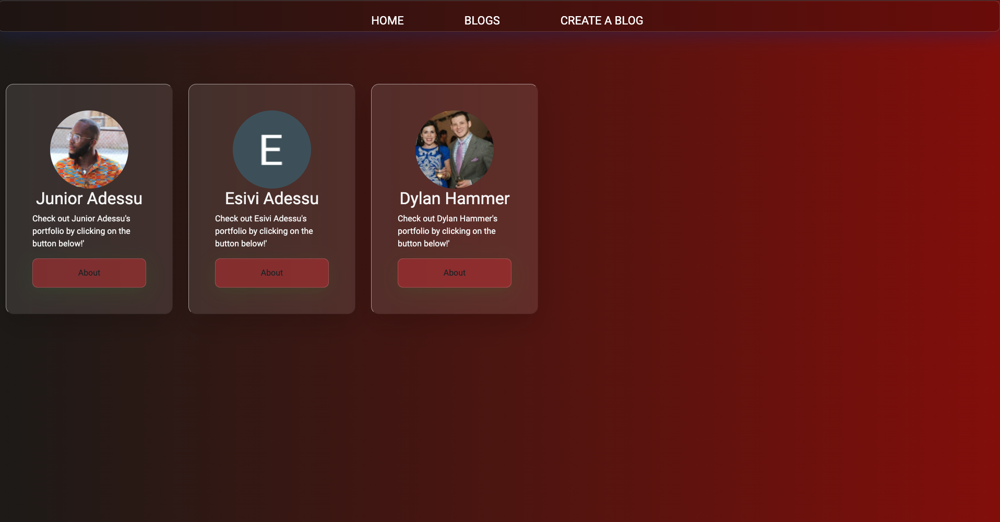
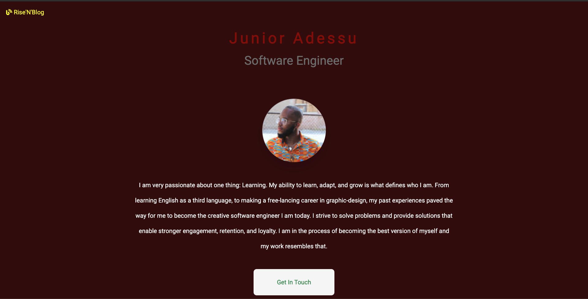

# Rise'N'Blog
## A blog website

[Rise'N'Blog WEBSITE](https://risenblog.herokuapp.com/)

Rise'N'Blog is an online blog website that allow users to view and create blogs. Sections included in this website:

- VIEW BLOGS
- CREATE BLOGS
- VIEW USER PROFILES
- CREATE A PROFILE

## Features

- User can navigate through the website which features many CSS effects.
- Add a blog for other users to read. 
- Read blogs posted by other users.
- View a page with all users that have logged into the app.
- View details about each individual user.

## Tech

### Languages and libraries

- [HTML] -The standard markup language for documents designed to be displayed in a web browser. 
- [CSS] - A style sheet language used for presentation of a wesbite.
- [JAVSCRIPT] - Prototype based object oriented language.
- [Bootstrap] - based design templates for interface components.
- [FLEXBOX] -  A layout model that allows elements to align and distribute space within a container. 
- [GRID] - Enables an author to align elements into columns and rows.
- [EJS] -  allows you to generate web pages that can include dynamic data and can share templated pieces with other web pages.
- [NODE/EXPRESS] - Responsible for server handling on the backend

### Websites
- [ICONS8](https://icons8.com/) - Download design elements for free: icons, photos, vector illustrations, and music for your videos.
- [uiGradients](https://uigradients.com/#Venice) - A handpicked collection of beautiful color gradients for designers and developers​.
- [neumorphism.io](https://neumorphism.io/#e0e0e0) - CSS code generator that will help with colors, gradients, and shadows.
- [fontawesome](https://fontawesome.com/) - Font Awesome is a font and icon toolkit based on CSS and Less.

### Images
- [Unsplash](https://www.unsplash.com/) - Beautiful, free images and photos that you can download and use for any project
- [Pexels](https://pexels.com/) - Free stock photos and videos you can use anywhere

   
 

# PSEUDOCODE

1.
 ## Home-Page  
Upon loading the page, the user will be presented with the homepage, which includes a greeting with their name(if they are logged in), a motivational quote, the _logo_, _blogs_, _create a blog_ and _profiles_.
    
>The user can acess the blogs created by other blogs and view the content of these blogs without needing to login
2. 
## Blogs  
On the blog page, a guess will have access to all the blogs to be viewed. The blog page will feature many blogs with their title, owner name, and summary
> If the user is viewing their own blogs, they get the ability to edit, update, or delete it upon clicking the view blog button. The full article of the particular blog is available to be viewed only after opening the blog, which will redirect the user to a view page.

>If there are no blogs yet, there will be a page to notified you of such and provide you with a link to create a blog, only after you have logged in.

3.

 ## Create a blog  
The create a blog section is where a user will create and publish a blog to the all blogs section of the website:
    
>The create blog forms will ask for the user's name, a title for the individual blog, a short summary of what the article is about, and the actual blog.

- The user will be presented with an option box that features many categories from frontend development, backend development, to UX/UI desgin. The image that represents the blog post is dependant on the category that the user selects.  
    - There is also a checkbox at the bottom of the page for the user to select and notify the users whether their specific blog is educational or not.  

4.
## Contributors  
The contributors page is where you can view a profile of anyone that has ever logged into the app. This profile will feature an avatar of the user, their name, and a link that will redirect you to that user's specific page.
> As a guess, you are able to view all the users that has log in into the app but you do not have access to learn about that user until you sign in.

> As user, you have access to the user's information, which features their name, their job, their brand statement along with their skills and a button to get in touch with such user.

> If the user has not written a brand statement yet, there is one that is already written for them and will be displayed.

> As the user of the profile you are viewing, you have access to everything other users have and more. You can add in any skills you want and you can delete skills. You also have the ability to add and edit your brand statement. 

>There is a section at the bottom of the page that explains what a brand statement is and how to write one.
            

 # WIREFRAME
### LANDING PAGE

### BLOG SECTION

### PROFILE SECTION

### ERD

# SPECIAL THANKS
- First and foremost, to all my instrcutors and peers from GA SEIR-EC-6-7. Everyone helped me one way or the other with this project and I am eternally grateful to all of them. Special shoutout to [Sam](https://www.linkedin.com/in/samuel-gemberling/) for helping me with most of the debugging issues I encountered.

- [albertwalicki](https://www.albertwalicki.com/glassmorphism-how-to-create) - This website's guide on how to design a glassmorphism website was my main inspiration for the look I decided to implement on the website.

- The Engineering Channel - All of my problems that couldn't be resolved with stackoverflow were easily resolved throught the engineering channel.

- [speckyboy](https://speckyboy.com/code-snippet-form-ui/) - Although I did not take any of the codes used as examples on this site, seeing how others approached forms in CSS gave me some ideas as to how to style my own.

- [Stackoflow](www.stackoverflow.com) - Links for each function from stack overflow that was tweaked will be included in the comments at the end of the JS file.

## APP SCREENSHOTS

 

## FUTURE UPDATES

- [ ] Implement an API to generate random quotes for the homepage
- [ ] Add a functionality for user to include their own image for their blog
- [ ] Add a functionality for user to upload image to be used as their profile avatar.
- [ ] Add a functionality to like and comment on blogs
- [ ] Finish the reach out functionality to send an email to the profile that is being viewed.
- [ ] Add a format to the blogs where you can seperate them into paragraphs, highlight important text, choose your own font, etc..
- [ ] Add more sections to the user's profile including education and portfolio.

 
 
 